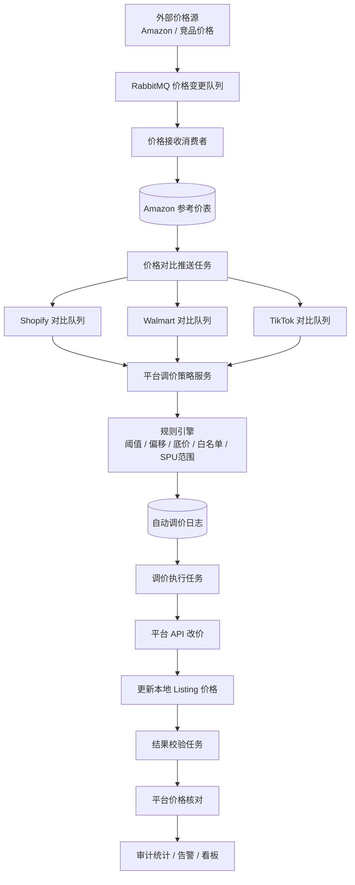

一个面向多电商平台的自动调价系统，根据外部竞品价格变化，结合账号配置、涨降价阈值、SPU 底价、白名单等规则，自动生成调价任务、调用平台 API 更新价格，并完成结果校验和审计统计。

## 项目背景

公司是主要做亚马逊的，但是也有小部分部门做外部平台，目前外部平台使用的产品是和亚马逊一样的，因此为了保持亚马逊的销量，外部平台的价格必须要紧跟亚马逊价格调整，但是人工跟踪并逐个调整 listing 价格成本高、响应慢，也容易出现误调价、漏调价和低于底价销售的问题。

本项目设计了一套“价格源接入 → 规则判断 → 平台改价 → 结果校验 → 审计看板”的自动化闭环，用于提升调价效率、降低运营成本，并保证价格调整过程可追踪、可回滚、可审计。

## 技术架构

技术栈：Laravel、MySQL、RabbitMQ、Redis、Artisan Command、平台开放 API、Vue + Element UI。

## 核心功能

- 支持多平台自动调价：Walmart、Shopify、TikTok Shop 可按平台独立扩展。
- 支持账号级调价配置：站点、币种、涨价比例、降价比例、涨价偏移、降价偏移。
- 支持调价范围控制：全部 listing 或指定 SPU 范围。
- 支持 SPU 底价保护：当竞品价格低于底价时，不盲目跟降。
- 支持白名单机制：指定 SKU 或平台 seller_sku 不参与自动调价。
- 支持同价 SPU 规则：指定 SPU 强制使用 0 偏移，跟随竞品价。
- 支持日志状态机：待处理、处理中、成功、失败、无需处理、已提交、重试用尽。
- 支持失败重试和不可重试错误识别，避免无效 API 调用。
- 支持调价后校验，确认平台实际价格与系统目标价格一致。
- 支持审计统计和企微告警，便于运营和技术排查问题。

## 核心设计

### 1. 事件驱动的异步调价链路

系统没有在接收到价格变更后直接调用平台 API，而是拆成多个异步阶段：

价格接收、价格对比、日志生成、平台改价、结果校验。

这样做的好处是每个阶段可以独立扩容，某个平台 API 异常不会阻塞整体链路，失败数据也可以通过日志表重新扫描处理。

### 2. 策略模式支持多平台扩展

公共服务负责配置管理、价格判断和流程分发；平台子类负责 listing 匹配、平台 API 调用和平台差异处理。

例如 Shopify 改价前会先拉取 variants 最新价格，Walmart 则直接基于本地 listing 价格对比，并支持批量 Feed 应急通道。新增平台时只需要实现平台服务类，不需要重写整套调价流程。

### 3. 可配置的价格规则引擎

调价判断不是简单地“跟随竞品价”，而是综合以下规则：

- 当前 listing 价格是否有效。
- 竞品价与当前价的涨跌幅是否超过配置阈值。
- 是否需要在竞品价基础上增加偏移金额。
- 是否命中 SPU 底价保护。
- 是否命中白名单。
- 是否命中同价 SPU 规则。
- 是否属于当前配置允许调价的 SPU 范围。

涉及价格计算的地方统一使用高精度计算，避免浮点误差造成误调价。

### 4. 日志驱动的可恢复流程

系统不会直接“算完就改”，而是先生成自动调价日志。日志既是调价任务，也是审计凭证。

执行任务扫描待处理日志，成功后标记为成功并进入待校验状态；失败后记录原因并累计重试次数；达到上限或命中不可重试错误后进入终态，避免反复消耗 API 配额。

### 5. 调价后的闭环校验

平台 API 返回成功不代表最终价格一定生效，因此系统会在调价后再次拉取平台价格，与目标价格做一致性校验。

如果发现同一 listing 后续已有更新的成功日志，旧日志会被标记为无需校验，避免旧价格影响新价格判断。

## 面试讲解稿

这个项目我会这样介绍：

我做的是一个跨平台电商自动调价系统，目标是解决运营人工跟价慢、容易误调价、缺少审计闭环的问题。系统会接收外部竞品价格变化，然后根据账号配置、涨降价阈值、SPU 底价、白名单等规则，自动判断是否需要调整 Walmart、Shopify 等平台的 listing 价格。

架构上我把它拆成了几个异步阶段：价格接收、价格对比、调价日志生成、平台改价和结果校验。中间通过 RabbitMQ 和数据库日志表解耦，保证某个平台 API 异常时不会影响其他平台，也方便失败任务重试和人工排查。

核心设计有两个点。第一是平台策略抽象，公共服务负责通用规则和流程分发，平台服务只处理各自的 listing 匹配和 API 差异，所以后续接入新平台成本比较低。第二是日志状态机，所有调价都会先落日志，再由定时任务执行，失败会有限重试，不可重试错误会直接终止，成功后还会做平台价格校验，形成完整闭环。

这个项目的难点不只是调用平台 API，而是如何保证价格调整安全可靠。比如降价不能低于 SPU 底价，涨跌幅超过阈值不能自动处理，白名单商品不能调价，同一 listing 多条价格变更只处理最新的一条。通过这些设计，系统既能自动化提效，又能降低误调价风险。

## 可继续优化

- 将调价规则抽象成独立规则链，方便动态组合和单元测试。
- 增加 Prometheus 指标，监控队列积压、调价成功率、校验失败率。
- 增加灰度调价能力，先对小范围账号或 SPU 生效。
- 增加 Webhook 回调或事件通知，让平台价格变更结果更实时。