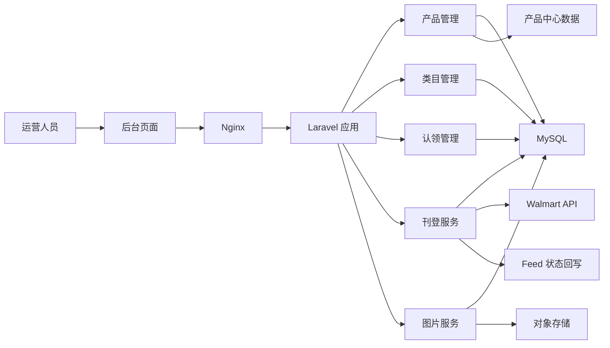
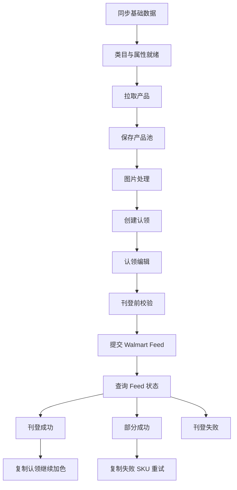

# Walmart Listing Demo

一个面向 Walmart Marketplace 的商品刊登管理系统。项目围绕“商品资料聚合、平台类目映射、认领编辑、Feed 提交、状态回写、失败重试”设计，目标是把复杂的跨境电商刊登流程沉淀为可配置、可追踪、可复用的后台系统。

> 说明：本仓库用于个人项目展示与面试讲解。演示环境会脱敏真实账号、密钥、内网服务和业务数据；涉及第三方平台接口的能力可切换为演示数据或 Mock 流程。

## 项目背景

跨境电商平台刊登并不是简单地把商品标题、图片、价格提交到 Walmart。真实业务中会遇到几个典型问题：

- 商品资料来自多个内部系统，字段结构复杂，SKU、颜色、尺码、图片、价格和类目需要重新组合。
- Walmart 不同站点、不同 ProductType 的属性要求不同，需要同步并维护平台类目和属性规格。
- 运营人员需要先“认领”商品，按店铺、站点、FeedType 和平台类目生成可编辑草稿。
- 刊登前需要做完整校验，刊登后需要跟踪 Feed 状态，并支持失败 SKU 的二次处理。
- 图片需要处理成展示图、缩略图并上传到对象存储，供 Walmart Feed 使用。

本项目的核心价值是：把“商品拉取 -> 类目映射 -> 认领编辑 -> Feed 构建 -> 刊登状态回写”做成一条清晰的新刊登链路，降低运营重复操作和开发维护成本。

## 技术栈

- 后端：PHP 7.1、Laravel 5.4
- 前端：Blade、Vue 2、Element UI
- 数据库：MySQL 5.7
- 缓存：Redis
- 部署：Docker、Docker Compose、Nginx、PHP-FPM
- 存储：OSS / S3 类对象存储
- 第三方接口：Walmart Marketplace API

## 系统架构



## 核心流程



## 功能列表

### 产品管理

- 支持按产品编号批量拉取商品资料。
- 将外部商品资料聚合为本地产品主表和详情 JSON。
- 支持产品列表搜索、认领状态过滤、拉取人过滤和时间过滤。
- 支持未认领产品删除和批量删除。
- 支持产品详情查看，包括 SPU、SKU、图片、属性等结构化数据。

### 类目管理

- 支持同步 ERP 分类树。
- 支持同步 Walmart 平台分类树。
- 支持同步 ProductType 属性规格。
- 支持按站点、FeedType、ProductType 查询属性。
- 支持维护“系统分类 -> Walmart 平台分类”的映射。
- 创建认领时可根据产品系统分类自动预览推荐映射。

### 图片管理

- 支持从产品资料中提取 SPU 图和 SKC 图。
- 支持展示图处理、缩略图生成和对象存储上传。
- 支持图片状态落库，认领时自动读取已处理图片。
- 支持认领编辑页手动上传和替换图片。

### 认领管理

- 支持单个产品创建认领。
- 支持批量创建认领。
- 以产品、店铺、站点、FeedType、平台类目为维度生成认领记录。
- 初始化 SPU 级 `visible/orderable` 和 SKU 级 `visible/orderable/images` 数据。
- 支持认领编辑页维护属性、颜色、尺码、UPC、图片和 SKU 禁用状态。
- 支持草稿保存、普通保存和保存并刊登。

### 刊登与状态回写

- 支持单条认领提交刊登。
- 支持同账号、同 FeedType 的多条认领批量合并提交。
- 支持刊登前完整校验。
- 支持生成 Walmart MPItem Feed 数据。
- 支持提交 Feed 后回写 `feed_id`。
- 支持查询 Feed 状态并按 SKU 子集计算每条认领的最终状态。
- 支持成功、失败、部分成功等状态管理。

### 失败重试

- 部分成功时，可提取失败 SKU 并复制为新的认领。
- 刊登成功后，可复制认领继续加色或二次编辑。
- 新复制认领会重置刊登状态，不会自动再次提交平台。

## 核心设计

### 1. 产品池和认领解耦

产品资料先进入 `wal_product` 和 `wal_product_detail`，不直接进入刊登流程。运营人员可以基于同一个产品，面向不同店铺、站点和 FeedType 创建多个认领。

这样做的好处：

- 产品资料只拉取一次，避免重复处理。
- 认领记录可以独立编辑、独立刊登、独立追踪状态。
- 后续新增店铺或加色时，可以复用产品池数据。

### 2. 认领详情使用结构化 JSON

认领详情落在 `wal_claim_detail`，核心字段包括：

- `visible`：SPU 级展示字段。
- `orderable`：SPU 级购买字段。
- `sku`：SKU 级属性、价格、图片和禁用状态。
- `skc`：颜色、尺码维度映射。
- `images`：SPU 图片集合。
- `variant_attr_names`：变体属性名称集合。

这种设计兼顾了 Walmart Feed 的复杂嵌套结构和后台编辑灵活性，避免为每类 ProductType 建大量定制字段表。

### 3. 平台类目属性树

Walmart ProductType 属性被同步到 `wal_category_attribute`，按树形结构存储：

- `leaf`：终值节点。
- `object`：对象节点。
- `array`：数组节点。
- `array_item`：数组元素模板。

认领创建时根据平台类目读取属性树，自动生成默认可编辑结构。这样新增 ProductType 或属性变化时，不需要频繁改前端表单和后端字段。

### 4. Feed 状态按认领粒度回写

批量刊登时，多个认领可以合并成一个 Walmart Feed。Walmart 返回的是 Feed 维度结果，但业务需要知道每条认领是否成功。

系统通过 `site_id + feed_id` 查询平台回执，再按每条认领自己的 SKU 集合计算状态：

- 全部成功：刊登成功。
- 全部失败：刊登失败。
- 部分成功：部分成功。
- 未完成：保持刊登中。

### 5. 失败 SKU 精准重试

对于部分成功的认领，系统不会让用户重新复制整批 SKU，而是从 Feed 回执中提取失败 SKU，生成一条新的认领，并将非失败 SKU 标记为禁用。

这样可以减少重复刊登、降低误操作风险，也让问题 SKU 的修复路径更清晰。

## 关键数据表

### Walmart 主库

- `wal_product`：新刊登产品主表。
- `wal_product_detail`：产品详情 JSON。
- `wal_claim`：认领主表。
- `wal_claim_detail`：认领详情 JSON。
- `wal_image`：展示图、缩略图和 OSS 地址。
- `wal_platform_category`：Walmart 平台类目。
- `wal_category_attribute`：Walmart ProductType 属性树。
- `wal_category_mapping`：系统分类到平台类目的映射。
- `wal_erp_category`：ERP 分类树。
- `wal_site`：Walmart 店铺账号。
- `wal_saler`：销售负责人。
- `wal_logs`：业务操作日志。

### 兼容依赖

- `wal_category_pool`
- `wal_erp_category_relation`
- `wal_category_v3`
- `wal_category_attr_v3`
- `wal_customs_code_manage`

### 跨库依赖

- `mc_upc_manage`：SKU 到 UPC 的映射。

## 部署说明

项目提供 Docker 部署文件，适合个人云服务器演示：

```bash
cp .env.docker.example .env
docker compose up -d --build nginx php mysql redis
docker compose exec php composer install --no-dev --prefer-dist
docker compose exec php php artisan key:generate
docker compose exec php php artisan config:clear
docker compose exec php php artisan cache:clear
```

默认只启动 Web、MySQL、Redis：

- 不启动定时任务。
- 不启动队列消费者。
- 不启动 RabbitMQ。
- 不启动 ClickHouse。

这样可以避免演示环境触发真实平台刊登、改库存或消息消费。

## 演示模式建议

为了让项目适合个人面试演示，建议演示环境做以下裁剪：

- 使用脱敏后的产品、店铺、类目、认领数据。
- 将 Walmart API 提交切换为 Mock 返回 `feed_id`。
- 将 Feed 状态查询切换为本地演示 payload。
- OSS 图片可使用公开演示图或本地静态图。
- 保留“产品列表、认领编辑、类目映射、刊登状态流转、失败 SKU 重试”作为核心演示闭环。

推荐演示路径：

1. 打开产品列表，展示已拉取产品。
2. 选择产品创建认领。
3. 展示类目映射和属性树自动初始化。
4. 进入认领编辑页，修改 SKU 属性、图片和 UPC。
5. 点击刊登，演示状态从“未刊登”变为“刊登中”。
6. 使用 Mock Feed 回执演示“部分成功”。
7. 点击复制失败 SKU，生成新的重试认领。

## 项目亮点

- 将复杂平台刊登流程拆成产品池、认领、编辑、刊登、状态回写等清晰模块。
- 使用类目属性树适配 Walmart 多 ProductType 的动态字段。
- 使用结构化 JSON 保存认领详情，兼顾灵活性和可追踪性。
- 支持批量刊登和 Feed 回执拆分回写。
- 支持失败 SKU 精准复制重试，减少运营重复操作。
- 提供 Docker 单机部署方案，适合个人云服务器演示。

## 面试讲解稿

### 1. 项目一句话介绍

这是一个 Walmart Marketplace 商品刊登系统，我负责的新刊登链路主要解决商品资料聚合、平台类目映射、认领编辑、Feed 提交和状态回写的问题。它把原本分散在多个系统和人工流程里的操作，收敛成一条可配置、可追踪的后台刊登流程。

### 2. 为什么要做这个系统

Walmart 刊登的难点不是提交接口本身，而是提交前的数据准备非常复杂。商品资料来自产品中心，图片要处理成平台要求的格式，类目属性随 ProductType 变化，SKU 还要维护颜色、尺码、UPC、价格和图片。如果这些都靠人工处理，很容易出错，也很难追踪失败原因。

所以我把流程拆成产品池、认领、编辑、刊登、状态回写几个阶段，每个阶段都有明确的数据表和状态流转。

### 3. 我负责的核心模块

我主要负责新刊登链路，包括：

- 产品拉取和本地产品池。
- Walmart 类目和属性规格管理。
- 产品认领和批量认领。
- 认领编辑页的数据结构设计。
- Feed 数据构建和刊登提交。
- Feed 状态查询、成功/失败/部分成功回写。
- 失败 SKU 复制重试。
- Docker 演示环境整理。

### 4. 技术设计怎么讲

我会重点讲三个设计：

第一是产品池和认领解耦。产品进入产品池后，可以被不同店铺、不同站点、不同 FeedType 多次认领。这样减少重复拉取，也方便后续加色和复制刊登。

第二是类目属性树。Walmart 的 ProductType 属性不是固定字段，所以我没有用一堆定制列，而是把属性同步成树形结构，认领创建时按属性树生成默认 JSON，前端根据 JSON 渲染和编辑。

第三是 Feed 状态拆分。批量刊登时多个认领会共用一个 feed_id，但运营关心的是每条认领是否成功。我通过 Feed 回执里的 SKU 结果，反推每条认领自己的状态，并支持部分成功后的失败 SKU 精准重试。

### 5. 遇到的难点

主要难点有三个：

第一是数据结构复杂。Walmart Feed 里既有 SPU 级字段，也有 SKU 级字段，还有数组、对象、变体图片等嵌套结构。我的做法是把认领详情设计成结构化 JSON，并把构建、校验、保存、提交分层处理。

第二是平台属性动态变化。不同 ProductType 属性不同，如果每个类目写死表单，维护成本很高。所以我把属性规格同步到数据库，用属性树驱动默认结构和校验逻辑。

第三是状态回写。Walmart Feed 是异步处理的，而且一个 Feed 里可能包含多条认领、多组 SKU。我设计了按 `site_id + feed_id` 查询、再按认领 SKU 集合拆分状态的逻辑，解决了批量刊登后的精细化状态管理。

### 6. 项目可以如何扩展

这个系统后续可以扩展到其他平台，比如 Shopify、Temu、TikTok。核心思路是抽象出平台刊登通用模型：产品池、平台类目、属性规格、认领草稿、发布服务、状态回写。不同平台只需要实现自己的类目同步、字段映射和发布适配器。

### 7. 如果面试官问你最大的收获

我的最大收获是：复杂业务系统不能只看接口调用，要先把业务状态和数据边界设计清楚。这个项目里我把刊登拆成多个可追踪阶段，每个阶段都有明确的状态和落库结构，这样后续排查问题、支持批量操作、处理失败重试都会容易很多。

